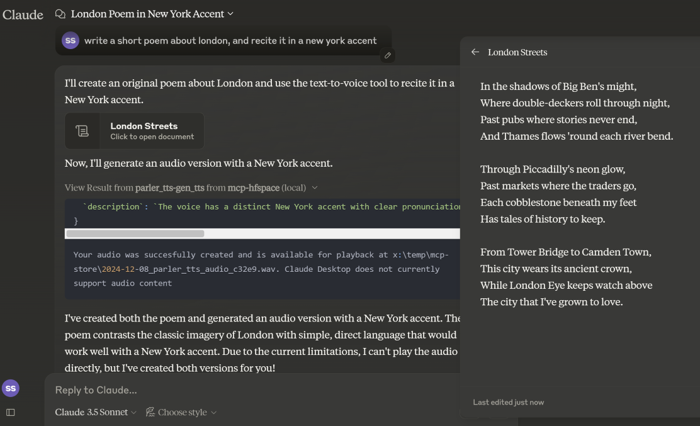
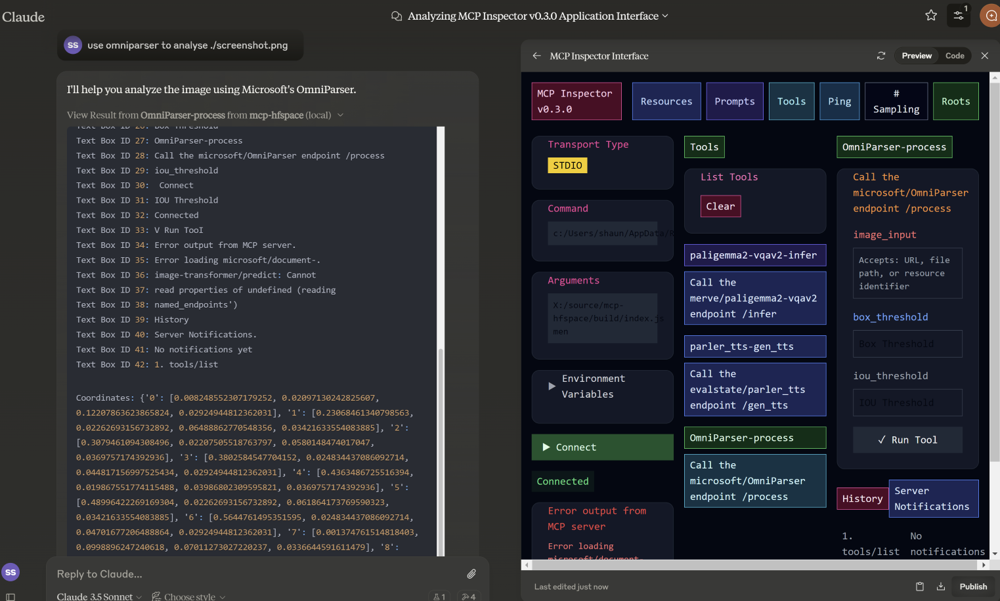

# mcp-hfspace MCP Server 🤗

Connect to [HuggingFace Spaces](https://huggingface.co/)  with minimal configuration needed - simply add your spaces and go!.

If no spaces are specified, it automatically connects to `evalstate/FLUX.1-schnell` providing Image Generation capabilities.

## Basic setup

Supply a list of HuggingFace spaces in the arguments. mcp-hfspace will find the most appropriate endpoint and automatically configure for usage. An example `claude_desktop_config.json` is supplied [below.](#installation)


It is recommended to set a Working Directory for handling upload and download of images and other file-based content. Specify either the `--work-dir=/your_directory` argument or `MCP_HF_WORK_DIR` environment variable. 

By default the current working directory is used by default which for Claude on Windows is `\users\<username>\AppData\Roaming\Claude\<version.number\` and on MacOS is `TODO`.

To use private spaces, supply your Hugging Face Token with either the  `--hf-token=hf_...` argument or `HF_TOKEN` environment variable.

Run multiple server instances to use different working folders and tokens if needed.

## File Handling and Claude Desktop Mode

By default, the server starts in "Claude Desktop" mode. This is intended to make best use of that Clients capabilities. 

### Example 1 - Image Generation (Download Image / Claude Vision)

We'll use `shuttleai/shuttle-3.1-aesthetic` to generate an image. The image gets saved to the Work Directory, as well as included in Claude's context window - enabling Claude's vision capabilities. 


### Example 2 - Image Recognition (Upload Image)

We'll use `big-vision/paligemma-hf` to ask a question of an image. In this case, we don't want to upload the Image to Claude - we'll reference a file in the WORK_DIR. So, we can ask Claude:

`paligemma to identify who is in the picture "bowie.jpg"` -> `Text Output: david bowie`

_If you are uploading something to Claude's context use the Paperclip Attachment button, otherwise specify the filename for the Server to send directly._

### Example 3 - Text-to-Speech (Download Audio)

In _Claude Desktop Mode_, the audio file is saved in the WORK_DIR, and Claude is. If not in desktop mode, the file is returned base64 encoded to the Client (useful if it supports embedded Audio attachments).




### Example 4 - Speech-to-Text (Upload Audio)

### Example 5 - Image-to-Image

In this example, we specify the filename for the Tool, and get returned an Image and 2 separate text objects. 
`use omniparser to analyse ./screenshot.png` and `use the analysis to produce an artifact that reproduces that screen`. 

In this instance, Omniparser was prompted with a filename, and returned an image and set of coordinates and annotations for the screenshot.


`microsoft/OmniParser`


### Specifying API Endpoint

If you need, you can specify a specific API Endpoint by adding it to the spacename. So rather than passing in `Qwen/Qwen2.5-72B-Instruct` you would use `Qwen/Qwen2.5-72B-Instruct/model_chat`.

## Recommended Spaces

Some recommended spaces to try:

- shuttleai/shuttle-3.1-aesthetic
- black-forest-labs/FLUX.1-schnell
- Qwen/Qwen2.5-72B-Instruct

**Image-to-Image**

- yanze/PuLID-FLUX

**Text-to-speech:**

- parler-tts/parler_tts
- suno/bark

**Speech-to-text**

- hf-audio/whisper-large-v3-turbo

**Text-to-music**

haoheliu/audioldm2-text2audio-text2music

**Vision Tasks**

- merve/paligemma2-vqav2

## Features

### Claude Desktop Mode

By default, the Server operates in _Claude Desktop Mode_. In this mode, Images are returned directly in the tool responses, while other binaries are saved in the working folder and a message is returned with the URI. 

Text Content is returned as a Text content type.

For other Client deployments, you will probably want the default behaviour so use --desktop-mode=false or CLAUDE_DESKTOP_MODE=false.


## Development

Install dependencies:

```bash
npm install
```

Build the server:#

```bash
npm run build
```

For development with auto-rebuild:

```bash
npm run watch
```

## Installation

To use with Claude Desktop, add the server config:

On MacOS: `~/Library/Application Support/Claude/claude_desktop_config.json`
On Windows: `%APPDATA%/Claude/claude_desktop_config.json`

```json
{
  "mcpServers": {
    "mcp-hfspace": {
      "command": "npx"
      "args:" [
        "-y",
        "@llmindset/mcp-hfspace",
        "--work-dir=~/mcp-files/ or x:/temp/mcp-files/",
        "--HF_TOKEN=HF_{optional token}"
        "Qwen/Qwen2-72B-Instruct",
        "black-forest-labs/FLUX.1-schnell",
        "foo/bar/baz"
        ...
        ]
    }
  }
}
```

### Debugging

Since MCP servers communicate over stdio, debugging can be challenging. We recommend using the [MCP Inspector](https://github.com/modelcontextprotocol/inspector), which is available as a package script:

```bash
npm run inspector
```

The Inspector will provide a URL to access debugging tools in your browser.

### Known Issues and Limitations

**mcp-hfspace**

- Endpoints with unnamed parameters are unsupported for the moment.

**Claude Desktop**

- Claude Desktop 0.75 doesn't seem to respond to errors from the MCP Server, timing out instead. For persistent issues, use the MCP Inspector to get a better look at diagnosing what's going wrong. If something suddenly stops working, it's probably a quota issue.
- Claude Desktop seems to use a hard timeout value of 60s, and doesn't seem to use Progress Notifications to manage UX alive. If you are using ZeroGPU spaces, large/heavy jobs may timeout. Check the WORK_DIR for results though; the MCP Server will still capture the result.
- Claude Desktops reporting of Server Status, logging etc. isn't great - use [@modelcontextprotocol/inspector](https://github.com/modelcontextprotocol/inspector) to help diagnose issues.

** HuggingFace Spaces**

- If ZeroGPU quotas become an issue, try duplicating the space, make it private, use dedicated hardware and use HF_TOKEN to access. 
